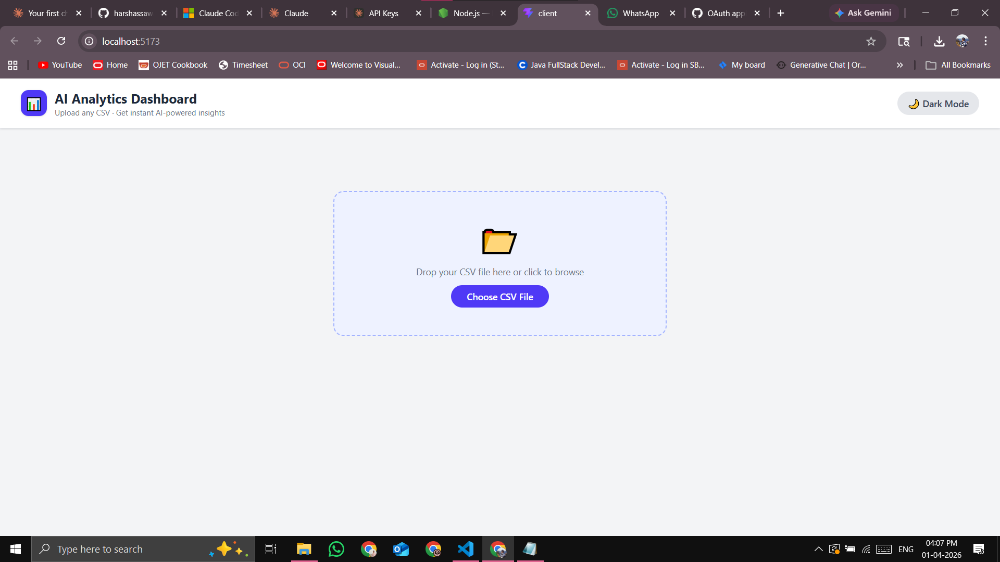
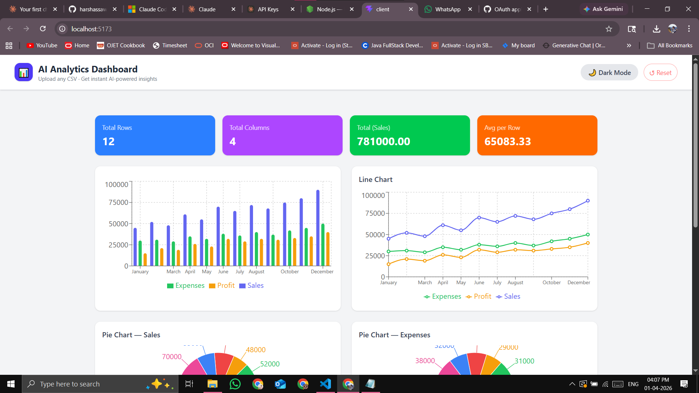
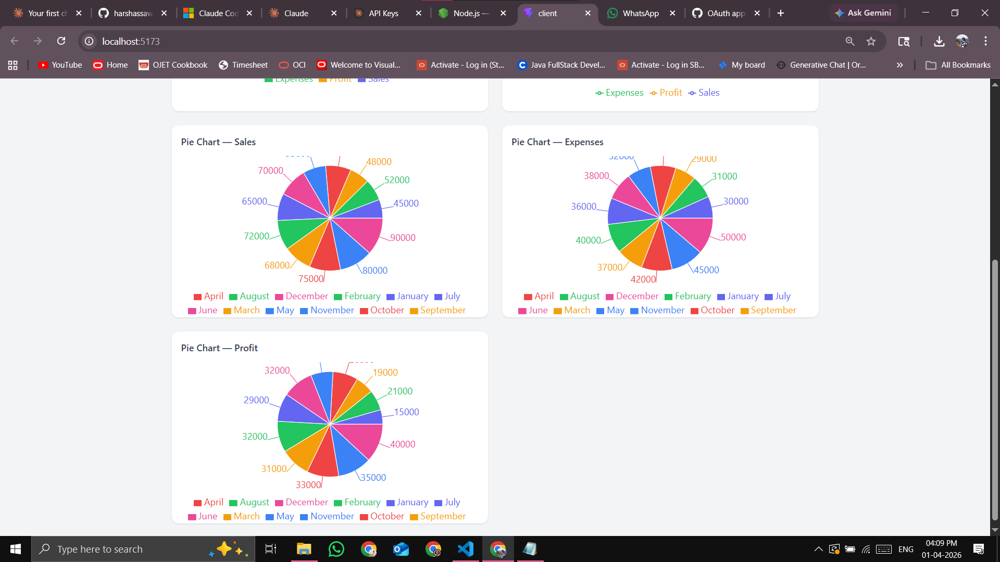
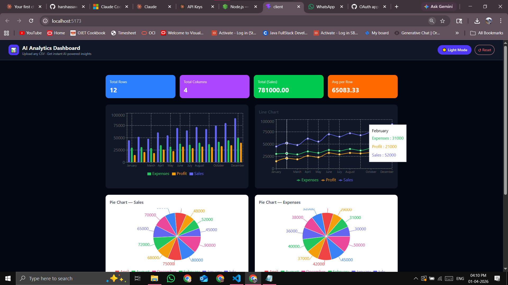

# 📊 AI Analytics Dashboard

A full-stack AI-powered analytics dashboard built with React.js and Node.js.
Upload any CSV file and instantly get interactive charts and AI-generated insights.

## 🚀 Features
- 📂 CSV file upload and parsing
- 📊 Dynamic Bar, Line and Pie charts (Recharts)
- 🤖 AI-powered data insights using Claude AI
- 🌙 Dark / Light mode toggle
- 📱 Fully responsive design

## 🛠️ Tech Stack
- **Frontend:** React.js, Recharts, Tailwind CSS, Vite
- **Backend:** Node.js, Express.js
- **AI:** Anthropic Claude API
- **Tools:** Multer, CSV-Parser, Axios

## ⚙️ Setup Instructions

### Prerequisites
- Node.js 18+
- Anthropic API Key

### Backend
```bash
cd server
npm install
# Create .env file with:
# PORT=5000
# CLAUDE_API_KEY=your_api_key_here
npm run dev
```

### Frontend
```bash
cd client
npm install
npm run dev
```

## 📸 Screenshots




